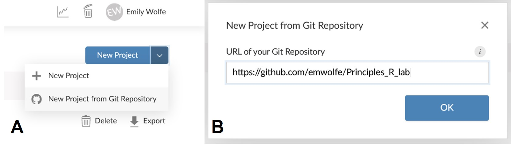
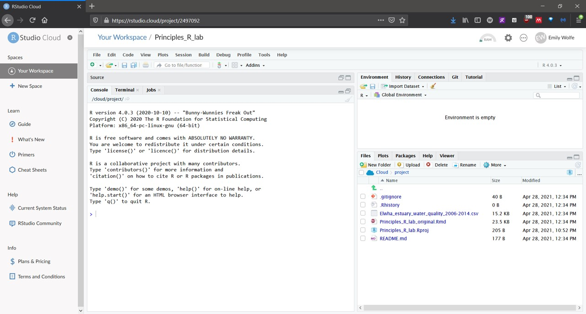
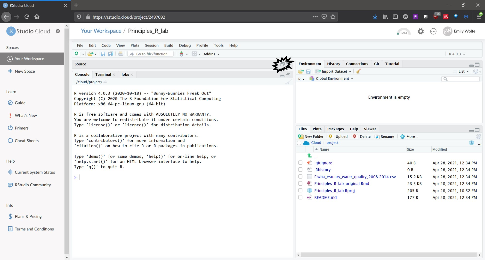
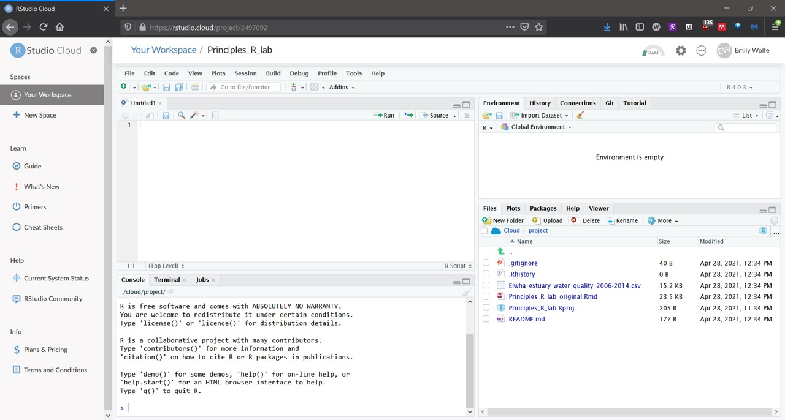
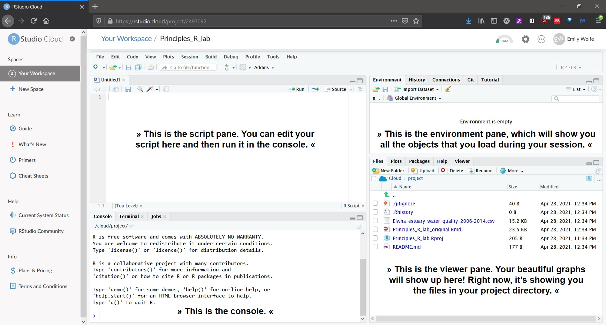
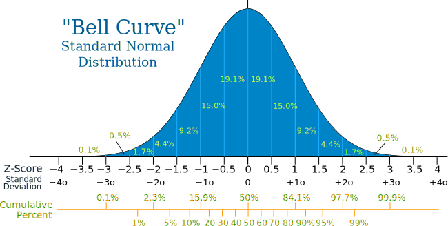

```{css, echo=FALSE, purl=FALSE}
pre code {
  white-space: pre-wrap;
}
```

Fun fact! This lab was originally written as an [R Markdown](http://rmarkdown.rstudio.com) Notebook, which means that it was written within RStudio, an integrated development environment (IDE) for R. R is a programming language that is open-source, so it is freely available for download and modification on a variety of operating systems. It is different from programs like Microsoft Excel in that it uses a command-line interface (the console) in order to execute commands. You can use R to do anything from simple math

```{r example}
#for example:
2 + 2

#hint: in RStudio Cloud, click on the green triangle in the top right corner of this chunk, then look at the console below for the output!
```

to running complex statistical analyses. R is also capable of producing publication-worthy figures, maps, and even interactive graphics. Today, we will be curating data from the internet, cleaning it for analysis in R, and then running a series of statistical tests in order to answer a scientific question. Many journal publications often end introduction sections with the main research question. After completing today's lab, we should be able to answer: <b>Does dam removal affect water quality parameters in the Elwha River?</b>

---

# Notes about the lab
These instructions are best viewed in the original HTML output.

Please note that all instructions within the lab were originally written on a Windows 10 machine with R version 3.5.2, Eggshell Igloo (12/20/2018 release), and updated with R version 4.0.5, Shake and Throw (3/31/2021 release). Keyboard shortcuts, some portions of R scripts, and screen displays <b>may vary for Mac OS users</b> if you choose to run this locally instead of in RStudio Cloud. For best results, complete this lab during your scheduled lab time in RStudio Cloud, especially since your TA will be able to answer questions!

Additional disclaimer: For simplicity, we are running parametric statistical tests in this lab and assuming that assumptions of normality and homoscedascity are met without transformation.

<b>Before you go further, make sure you have downloaded a local copy of the write-up (<code>Lab_8_R_write-up.docx</code>) from D2L so you can follow along and answer the questions!</b>

---

# Step 1: Collect the data
Before we can use R, we need to collect our data. Today we will be using a publicly-available dataset from the United States Geological Survey (USGS). The title of the study we are using is: <b>Ecological parameters in the Elwha River estuary before and during dam removal</b>. The USGS page is located at this URL: <code> https://www.sciencebase.gov/catalog/item/58e5437ae4b09da679997d4e</code>, and the published study is located [here](https://esajournals.onlinelibrary.wiley.com/doi/abs/10.1002/ecm.1268). Look through all of the <b>Child Items</b> by clicking <b>More</b>; we will be going to the file entitled: <b>Water quality in the Elwha River estuary, Washington, from 2006 to 2014</b>. Visit this page and check out the information provided. You should find a summary of the study, followed by a section titled "Attached Files" that includes two files.

The .csv is a comma-separated values text file. This type of file is viewable as a spreadsheet in Excel, but you can also view it in a text editor like Notepad. <b>Download this and take a look around at not only what it contains, but how the data are oriented.</b> It is very important to know if your data are organized in a way that will be understood by the commands you use in your R scripts. When files are in .csv format, it is usually a good sign. The structure of this spreadsheet is critical to analysis in R. Some key things to notice include:

1. <b>Data are organized by rows and columns with descriptive column headers.</b> Cell A1 contains the first column header, and columns continue across row 1. There are no merged cells and there are no empty rows.
2. <b>Samples are organized by row, and variables by column.</b> This format is relatively standard for analyses, especially when we are importing files into R. 
3. <b>All sampling times are included in a single table of data.</b> In previous quarters, you might have included multiple trials all on the same sheet, skipping a few rows in between. Our data need to be organized in such a way that the values are continuous, with no missing rows. Check out how the different sampling dates and sites are coded so that they can all be included within the same table.

This is how most types of data should be organized for statistical analysis!

The other file is an .xml document that gives us available metadata. Metadata are data about data--in other words, metadata are the details, labels, and notes that help provide context for variables or categories that appear in the raw dataset. For example, if we labeled study sites A, B, and C in our raw data file, the metadata might tell us the GPS coordinates, names of the nearest municipality, or other details that would help someone unfamiliar with the project to understand the data. In ecological datasets, species are often represented by codes (e.g. ALVI stands for <i>Alnus viridis</i>), so the full species names are included in the metadata. It is important to keep good metadata files associated with raw data files and R scripts to improve reproducibility. Just think about how hard it is to read someone else's spreadsheet! Feel free to take a look at the .xml document, since <b>we will reference it later to find out in what units the water quality parameters were measured for our figures.</b>

---

# Step 2: Import the data into RStudio Cloud
Okay, we've looked at the data but now what? We will be using a cloud-based version of RStudio, which means you won't need to download anything special--just use your favorite browser! Let's break this Step 2 down into more digestible pieces:

1. Open up the [RStudio Cloud Project](https://rstudio.cloud/projects).
2. Create and log in with a Google account (e.g. your PSU @pdx.edu email).
3. Create a new project from a Git Repository by clicking on the blue button in the top right of the empty workspace, and entering the following URL into the pop-up: <code>https://github.com/emwolfe/Principles_R_lab</code>. 
<center>



</center>
4. Click on the project <code>Principles_R_lab</code>. It should look something like this when you open it up:
<center>



</center>
All right, let's talk about what you just imported into your RStudio Cloud workspace. A Git Repository is just a place where certain code-associated files are stored on [GitHub](https://github.com). These files can then be worked on collaboratively using version control. Have you ever accidentally saved over part of your lab report that you wish you could still access? Well, version control is exactly that--each iteration of edits is saved as its own little version, allowing you to revert back to a previous draft if, say, your cat accidentally walks across your keyboard and that masterpiece is saved instead of your assignment. Version control lets us increase the reproducibility of our results, and increases transparency during peer-review. Many journals now require datasets to be deposited in repositories like GitHub as a condition of publication.

Specifically, you imported an <code>R Project</code>. This is just R-speak for a self-contained working directory. If you were working in RStudio installed on your computer (i.e. locally) rather than RStudio Cloud, you would need to tell R where to look for files--i.e. the directory that we need to work in. So what does this mean for us if we're in the cloud? Let's take a closer look at RStudio Cloud to get a better idea of what you're looking at in all those panes.

First, expand all the panes by clicking on this button:
<center>



</center>

You should see something like this now:

<center>



</center>

See how it says <code>Untitled1</code> in the corner? It's already opened an R script file for you to type into! RStudio is great because there is an autosave feature, but we should still save our script just in case. Go to File and Save as... and save your new script as <code>Lab_8_script</code>. If you saved it in the default location, you'll see the script file pop up in the list in the bottom-right pane. Here is an annotated view of the different panes:

<center>



</center>

Now remember what we learned about an <code>R Project</code> being a self-contained directory? We can check this by asking R what the current working directory is. Type the following code into your newly-saved script, and then either highlight it and press <code>CTRL + Enter</code> (<code>CMD + Enter</code> on an Apple keyboard) or click the <code>Run</code> button in the script pane:

```{r check_wd}

getwd() #tells you current working directory information

###note that you must tell R to run (either through keyboard shortcuts or by clicking Run) each line of code or nothing will happen!!

```

What is the output? R should confirm that your current working directory matches the path name you see in the viewer pane. If anything else shows up after <code>getwd()</code>, consult your TA.

Now that we have told R where to look for our files, we can import our .csv that we looked at earlier. Note that the .csv is <i>already included within the project directory</i>, so you don't need to upload anything. First, we are creating an object called <code>Elwha_data</code> in our environment that is a data frame, using the data in our .csv file. <b>R is case sensitive.</b> When typing function or object names, you must be <b>exact</b> or R will produce an error because it will not recognize the command. This is why it is helpful to replace spaces with underscores because they are easier to see. Our data frame name has both a capital letter to start, and an underscore that we need to remember to be able to reference it.

```{r load_data}

Elwha_data <- read.csv("Elwha_estuary_water_quality_2006-2014.csv",check.names = F) #reading in our .csv
Elwha_data #look at the data frame you created
colnames(Elwha_data)

```

But before we go further, what do you notice about the column names? 

1. <b>Column headers should not have spaces within the names.</b> This can cause issues when working in R since names must be exact. R will also convert spaces to periods, which can be confused with function names.
2. <b>Remove the + and % that appear in two of the column headers.</b> It will make it easier to refer to these columns in R if we change their names.
3. <b>NS (no sample) needs to be replaced with NA.</b> This is just so R will know to exclude these rows. 

Ordinarily, we would clean these data in R. (Bonus code is included here if you'd like to give it a try!) 

```{r bonus_clean_up}
###THIS IS A BONUS SECTION--IF YOU DO NOT WANT TO ATTEMPT TO CLEAN THE DATA ON YOUR OWN, SKIP THIS CHUNK!###

colnames(Elwha_data)[colnames(Elwha_data) == "Nitrate + Nitrite concentration"] <- "Nitrate_Nitrite concentration" #rename column to remove +
colnames(Elwha_data)[colnames(Elwha_data) == "% Dissolved oxygen"] <- "Perc Dissolved oxygen" #rename column to remove %

names(Elwha_data) <- gsub(" ", "_", names(Elwha_data)) #replace spaces with underscores

Elwha_data[Elwha_data == "NS"] <- NA #replaces "NS", which stands for "no sample was collected" with NA, the correct syntax for R to recognize a missing value

Elwha_data <- Elwha_data[1:147,] #gets rid of a few extra, empty rows that were hanging around for no reason

```

Using <code>str()</code> is helpful because we can get an idea of the <b><u>str</u></b>ucture of our object (<code>Elwha_data</code>), and about what types of data R thinks is in our columns. If you look at the output, you can see that <code>Dam_Condition</code> is considered <code>character</code> and Temperature is <code>numeric</code>, while Replicate is <code>integer</code>. Well, R is almost right. With the newest R update, R now interprets most variables containing letters as character vectors even if they would more efficiently be classified as factors. What does this mean? Let's recall what these words mean first, especially with respect to data.

1. <b><code>Characters</code> and <code>factors</code> refer to categorical data.</b> Things like HEADS or TAILS, or TRUE and FALSE are categorical. Data can be placed into a particular category; it is discrete. There are only so many categories that data can be sorted into, and those categories cannot be broken down into smaller classes. Factors usually contain words, which make them easy to spot.
2. <b><code>Numeric</code> is another word for continuous data.</b> These data can take on any value--even a fraction.  An example of continuous data are measurements of plant height (or just height in general). These data are always numbers. 
3. <b><code>Integer</code> is another word for whole number.</b> This means that they are never fractions (i.e. decimals). Count data would fall into this category because you can only count a whole number of elephants, for example. You would (hopefully) never count half an elephant.

With that said, let's change some of these variables into factors and numeric vectors.

```{r factors}
###THIS IS A BONUS SECTION--IF YOU DO NOT WANT TO ATTEMPT TO CLEAN THE DATA ON YOUR OWN, SKIP THIS CHUNK!###

Elwha_data$Dam_Condition <- as.factor(Elwha_data$Dam_Condition) #the dollar sign helps us give R an absolute reference, similar to Excel syntax
Elwha_data$Site_Name <- as.factor(Elwha_data$Site_Name)

Elwha_data$Phosphate_concentration <- as.numeric(Elwha_data$Phosphate_concentration)
Elwha_data$Nitrate_Nitrite_concentration <- as.numeric(Elwha_data$Nitrate_Nitrite_concentration)
Elwha_data$Ammonium_concentration <- as.numeric(Elwha_data$Ammonium_concentration)
Elwha_data$Salinity <- as.numeric(Elwha_data$Salinity)
Elwha_data$Temperature <- as.numeric(Elwha_data$Temperature)
Elwha_data$Turbidity <- as.numeric(Elwha_data$Turbidity)
Elwha_data$Dissolved_oxygen <- as.numeric(Elwha_data$Dissolved_oxygen)
Elwha_data$Perc_Dissolved_oxygen <- as.numeric(Elwha_data$Perc_Dissolved_oxygen)
Elwha_data$pH <- as.numeric(Elwha_data$pH)

```

Now let's look at the data frame structure again to make sure our changes were made appropriately.

```{r structure_data}
###THIS IS A BONUS SECTION--IF YOU DO NOT WANT TO ATTEMPT TO CLEAN THE DATA ON YOUR OWN, SKIP THIS CHUNK!###
str(Elwha_data)

```

However, for the purposes of this activity, the cleaned data are provided for you. 

```{r cleaned_data}
###skip this chunk if you did the bonus section###
Elwha_data <- read.csv("cleaned_data.csv",check.names = T) #reading in our .csv
```

Let's take a look at our beautiful, cleaned data.

```{r data_look}
str(Elwha_data) #tells us about our data frame
Elwha_data[1:5,1:5] #lets us preview the first 5 rows and columns, respectively - [r,c], and the : between numbers means that you are looking at the continuous range between them, like what appears in Excel when you select consecutive cells. You could read it as "through," so that 1:5 would read 1 through 5.
```

Looks great! We can move on to the more exciting part of summarizing our data.

---

# Step 3: Summarize the data in R

Now that we have discussed types of data, let's generate a summary of one of our variables. We want to know what pH looks like--what are the minimum, maximum, and middle values? These make up what are called <b>descriptive statistics</b>. Let's start by finding our mean, which is the average of our pH values.

```{r mean_pH}

mean_pH <- mean(Elwha_data$pH); mean_pH

```

Does this make sense? We need to add an argument to help R exclude the rows with missing pH values.

```{r mean_rm}

mean_pH <- mean(Elwha_data$pH, na.rm = TRUE); mean_pH #remove rows within column with value NA

```

Let's try finding the median now. The median gives us an idea of how skewed our data are--you might have heard of median home prices or income. It tells us where the middle point of our distribution is.

```{r median}

median(Elwha_data$pH, na.rm=TRUE)

```

Now let's define our range, which tells us the minimum and maximum values within our dataset.

```{r min_max}

#you can use a semi-colon to combine multiple commands to be more efficient
min(Elwha_data$pH, na.rm = TRUE); max(Elwha_data$pH, na.rm = TRUE)

```

The standard deviation is the final part of our five-point summary, and tells us how much variation is in our data. In other words, it tells us how far the data is spread from the mean.

```{r sd}

sd_pH <- sd(Elwha_data$pH, na.rm = TRUE); sd_pH

```

Now that we know the standard deviation, we can report: <b>The pH (mean±sd) averaged `r mean_pH`±`r sd_pH` over the course of the study</b>. This is similar to the calculation of confidence intervals, which give us the probability that the true mean falls within a certain range. Since we have been using alpha = 0.05 as our significance threshold in Principles, let's calculate a 95% confidence interval for pH.

Instead of standard deviation, we are going to calculate standard error based on our alpha = 0.05. However, we need to divide 0.05 in half (because we are doing a two-sided test), because we need to consider values at the very tail ends on either side of a normal distribution, like the one pictured below.

<center>



</center>

```{r CI}

mean_pH <- mean(Elwha_data$pH, na.rm = TRUE)
std_pH <-sd(Elwha_data$pH, na.rm = TRUE)
error <- qnorm(0.975)*std_pH/sqrt(147) #147 is the total number of observations (our n), which is found in the str() output
left <- mean_pH-error
right <- mean_pH+error
left; right

```

We can interpret this as being 95% confident that the true mean pH is found between `r left` and `r right`, assuming that our distribution is normal. 

# Step 4: Analyze the data in R

However, we want to answer our question about dam removal, and whether or not that affected water quality. Think back to what <code>str()</code> told us about our data--we have two treatment categories: before removal, and during dam removal. Let's compare the mean pH in each group, and see if there is a treatment effect; i.e., did dam removal affect pH?

Because we have two treatment groups, we can use a t-test, which is hopefully familiar from previous quarters of Principles. The t-test is used for when there are two independent categories (<code>Before removal</code> and <code>During removal</code>) for a given variable (<code>Dam_Condition</code>), and a continuous dependent variable (<code>pH</code>). A t-test is used to determine if there are significant differences between the means of the two groups. This video from Bozeman Science on Youtube may be helpful: https://www.youtube.com/watch?v=pTmLQvMM-1M. It demonstrates how to run a t-test in Excel, though. Let's run one in R.

```{r t_test}

ttest <- t.test(pH~Dam_Condition, data=Elwha_data); ttest

```

Let's report our results in the context of the study: <b>pH was significantly higher during dam removal compared to before dam removal (t=`r ttest$statistic`, df=`r ttest$parameter`, p=`r ttest$p.value`)</b>. Note that the means for each group are displayed at the end of the t-test output. 

So now we know that the dam removal process affected pH... except now we're curious to know if pH is different among sampling sites during dam removal. Let's subset our data frame so that we just have data from during the dam removal.

```{r during_subset}

during_dam <- subset(Elwha_data,Elwha_data$Dam_Condition=="During removal")
during_dam[1:5,1:5]

```

Now that we've created a subset, we need to use analysis of variance (ANOVA) to test for differences among sites, since there are more than two. Remember standard deviation? Variance is the square of standard deviation (sd^2). ANOVA is used when there are more than two categories for a given independent variable (<code>Site_Name</code>), and a continuous dependent variable (<code>pH</code>). Using <code>str()</code> for our new subset shows that there are 5 different sites, and pH is still continuous, so ANOVA is appropriate.

```{r ANOVA}

pH_ANOVA <- aov(pH~Site_Name, data=during_dam)
summarypH <- summary(pH_ANOVA); summarypH

```

Let's report our results in the context of the study: <b>There was no significant difference in pH among sampling sites during dam removal (F=`r summary(pH_ANOVA)[[1]][1,4]`; df=`r summary(pH_ANOVA)[[1]][1,1]`,`r summary(pH_ANOVA)[[1]][2,1]`; p=`r summary(pH_ANOVA)[[1]][1,5]`)</b>. We can also make a nice figure to show these differences.

```{r plot_pH, fig.align='center'}

plot(pH~Site_Name, data=Elwha_data)

```

These boxplots are useful because they show us outliers (the two open circles in ES1), medians (thick black lines in the middle of the boxes), quartiles (outer bounds of the boxes), and minimum and maximum values (excluding outliers; the lines at the end of the dotted-line arms). We can get an idea of the distributions for each site this way. 

We can also make a nice bar chart with standard deviation, though. Just like in Excel, we need to calculate the mean and standard deviation of each group.


```{r libraries, fig.align='center'}
chooseCRANmirror(ind=1)
install.packages("plyr",repos='http://cran.us.r-project.org')
install.packages("dplyr",repos='http://cran.us.r-project.org') #different packages house different sets of functions - we need a function in package plyr
library(plyr) #tells R to open the library of functions contained in plyr
library(dplyr) #tells R to open the library of functions contained in dplyr

for_aov_plot <- ddply(during_dam,~Site_Name,summarize,mean=mean(pH, na.rm=TRUE),sd=sd(pH, na.rm = TRUE))

for_aov_plot

install.packages("ggplot2")
library(ggplot2)

plot <- ggplot(for_aov_plot, aes(x=Site_Name, y=mean)) + geom_bar(aes(fill=Site_Name),stat="identity", color="black", position=position_dodge()) + geom_errorbar(aes(ymin=mean-sd, ymax=mean+sd)) + labs(x="Sample Site",y="pH",fill="Sample Site")

plot

```

Look how beautiful our graph is! We've configured all of the axis labels on it, too. 

What about all of the other continuous variables, though? We can examine relationships between continuous variables with regression--hopefully another familiar term from previous quarters! Let's test to see if increased pH during dam removal affects dissolved oxygen (which would be very important to organisms living within the river).

```{r lm_DO_pH}

DO_pH_reg <- lm(Dissolved_oxygen~pH, data=Elwha_data)
DO_pH_reg
summaryDO <- summary(DO_pH_reg); summaryDO

```

Let's report our results in the context of the study: <b>There was no significant relationship between dissolved oxygen and pH (F=`r summaryDO$fstatistic[1]`; df=`r summaryDO$fstatistic[2]`,`r summaryDO$fstatistic[3]`; p=0.2319). pH only explains `r summaryDO$adj.r.squared[1]*100`% of the variation in dissolved oxygen.</b> Let's make a plot to go with our results.

```{r plot_DO_pH, fig.align='center'}

plot(Dissolved_oxygen~pH, data=Elwha_data,xlab="pH", ylab="Dissolved oxygen (mg/L)") #the plot function doesn't use any special packages - it is in what we call base R; for units on Dissolved oxygen, we should check the metadata
abline(lm(Dissolved_oxygen~pH, data=Elwha_data)) #plots our regression line

```

Now it's more obvious how poor the fit is for our data. The scatterplot is scattered!

Let's try examining if there is a correlation between phosphate, and nitrate and nitrite concentrations. A correlation does not indicate that there is predictive power, like in a regression analysis. Correlation simply determines if the two variables are associated with one another.

```{r cor}

P_NO3_cor <- cor.test(Elwha_data$Phosphate_concentration,Elwha_data$Nitrate_Nitrite_concentration,method="pearson",use = "complete.obs") #another way to reference the columns; use argument omits rows with NA values
P_NO3_cor

```

The p-value is obvious, but the correlation coefficient is less evident. <code>cor</code> tells us the strength of the association between phosphate concentration and nitrate & nitrite concentration--e.g. where -1 is a perfect negative correlation, 0 is no correlation, and 1 is a perfect positive correlation. Our value here is `r P_NO3_cor$estimate`. Let's report our results in the context of the study: <b> There is a significant association between phosphate concentration and nitrate & nitrite concentration (t=`r P_NO3_cor$statistic`, df=`r P_NO3_cor$parameter`, p=`r P_NO3_cor$p.value`). Phosphate concentration was moderately positively correlated with nitrate & nitrite concentration (r=`r P_NO3_cor$estimate`).</b> Let's make another plot to look at the correlation.

```{r plot_P_NO3, fig.align='center'}

plot(Elwha_data$Phosphate_concentration~Elwha_data$Nitrate_Nitrite_concentration, xlab="Nitrate & Nitrite (micromolar)", ylab="Phosphate (micromolar)")
abline(lm(Elwha_data$Phosphate_concentration~Elwha_data$Nitrate_Nitrite_concentration))

```

...and that's it! Congratulations! You made it through the activity! Hopefully you feel a little more confident about using a command-line interface, R, and statistics. Today we learned about:

* publicly-available data
* RStudio Cloud
* GitHub and Git Repositories
* creating and editing scripts in R
* cleaning data (i.e. preparing raw data for analyses)
* summary & univariate statistics
* basic plotting in base R and ggplot2

Thanks for investing time and energy in this workshop! If you have any technical feedback, please contact the author through [GitHub](https://github.com/emwolfe).
